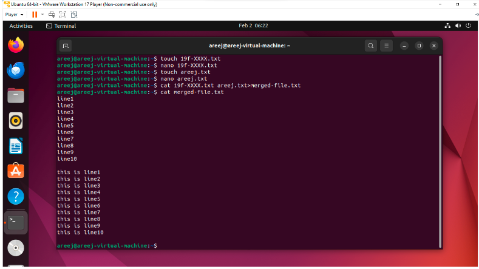
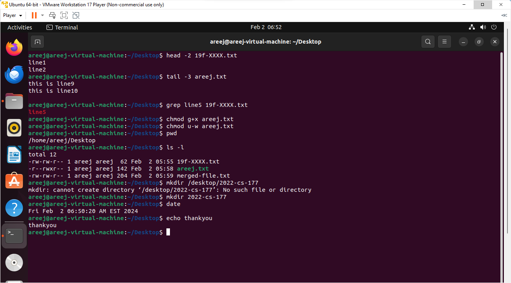
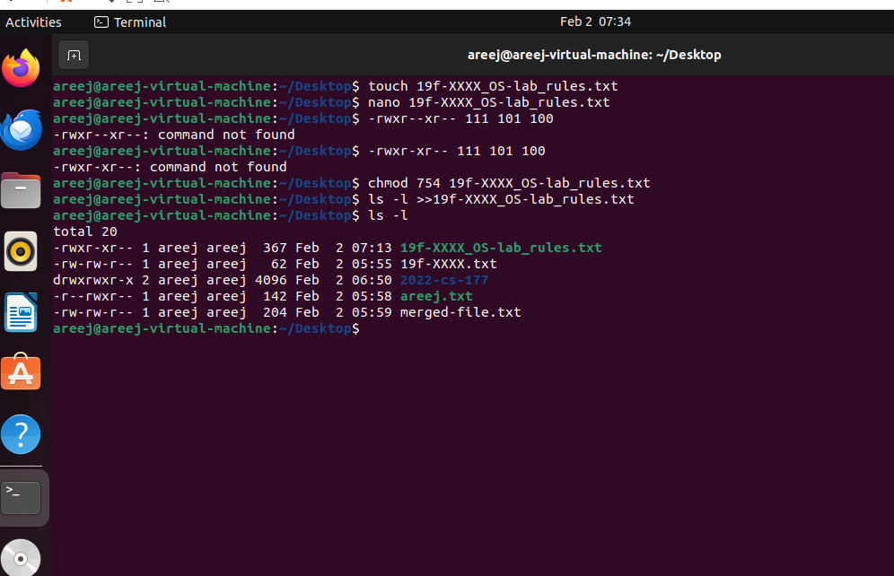

#                                  **Lab2**

## **Task1:**

1. **Created a file named "19f-XXXX.txt" with at least 10 lines:**
   Used the `echo` command to write 10 lines of text into a file named "19f-XXXX.txt". This file contains various lines numbered from 1 to 10.

2. **Created another file named "your name.txt" with at least 10 lines:**
   Used the `echo` command to write 10 lines of text into a file named "your name.txt". This file contains alphabetically labeled lines from A to J.

3. **Merged the data of both files:**
   Used the `cat` command to concatenate the content of "19f-XXXX.txt" and "your name.txt" and saved the result into a new file named "merged_file.txt".

4. **Redirected the output to a new file:**
   Used the `>` operator to redirect the output of the `cat` command to a new file named "merged_file.txt", containing the merged content of the first two files.

5. **Displayed the first two lines of the first file:**
   Used the `head` command with the `-n 2` option to display the first two lines of the "19f-XXXX.txt" file.

6. **Displayed the last two lines of the second file:**
   Used the `tail` command with the `-n 2` option to display the last two lines of the "your name.txt" file.

7. **Found the string "line5" from the first file:**
   Used the `grep` command to search for the string "line5" in the "19f-XXXX.txt" file.

8. **Granted execute permission of the second file to the group:**
   Used the `chmod` command with the `g+x` option to grant execute permission to the group on the "your name.txt" file.

9. **Removed the write permission for the owner:**
   Used the `chmod` command with the `u-w` option to remove write permission for the owner on the "your name.txt" file.

10. **Helped Mr. Tom find his current location:**
    Used the `pwd` command to print the current working directory, helping Mr. Tom locate himself in the file system.

11. **Listed all files present on the Desktop directory:**
    Used the `ls` command with the appropriate directory path to list all files on Mr. Tom's Desktop.

12. **Created a folder named "2022-cs-177":**
    Used the `mkdir` command to create a folder on the Desktop with the name "2022-cs-177", where Mr. Tom can store his personal files and pictures.

13. **Displayed the current time:**
    Used the `date` command to display the current system time.

14. **Displayed a thank you message:**
    Printed a thank you message to acknowledge Mr. Tom's completion of the tasks and express gratitude for his cooperation.

    

    

    

    

## **Task2:**

1. **Created a file named "19f-XXXX_OS-lab_rules.txt" with lab rules:**
   Used the `echo` command to generate the content for a file named "19f-XXXX_OS-lab_rules.txt". The content includes lab rules for the OS Lab, covering topics such as plagiarism, submission format, naming conventions, and consequences for cheating.

2. **Added the lab rules in the file:****

   opened the file in prompt and have written the lab rules in the .txt file.

3. **Set the rights of the created file to (-rwxr-xr--):**
   Used the `chmod` command to change the permissions of the "19f-XXXX_OS-lab_rules.txt" file. The specified permissions were converted from symbolic notation (-rwxr-xr--) to numeric format (754) using the binary number system. Applied the derived numeric value (754) to set the file permissions accordingly.

4. **Appended the output of ls command to the created file:**
   Utilized the `ls -l` command to list detailed information about files in the current directory. Appended the output of this command to the "19f-XXXX_OS-lab_rules.txt" file, providing a detailed listing of files, including their permissions, owner, group, size, modification time, and filename.

**Github repo link:**https://github.com/areej-fatimaa/OperatingSystem/tree/main/OperatingSystemLabs