# **Lab3**

### Task 1: Mr. Tom's Ubuntu Adventure

1. **Create a script to multiply command line arguments:** Created a simple script, named `multiply.sh`, using the `"$#"` to check if exactly two command line arguments are provided. Used `$(($1 * $2))` to multiply the arguments and echoed the result.

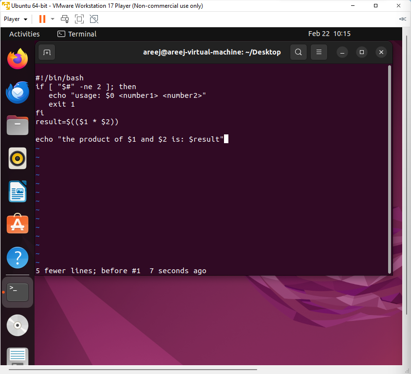

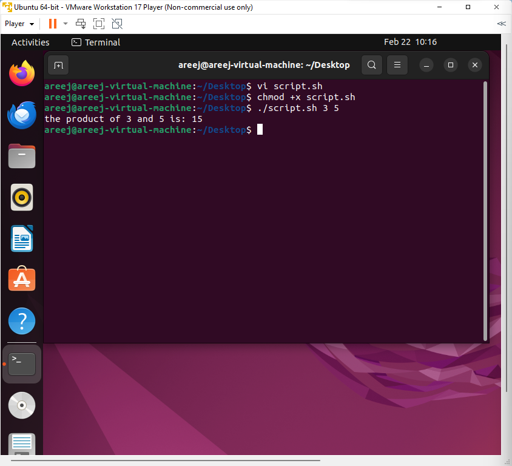

**2.Create a script to combine user input:** Created a script, named `userinfo.sh`, using `read` to gather user information. Combined the input into a message and echoed it.

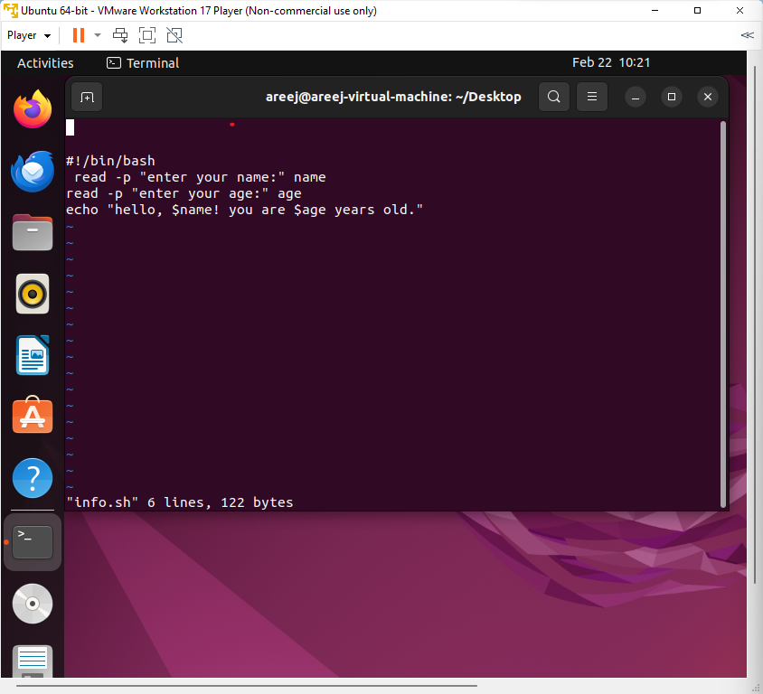

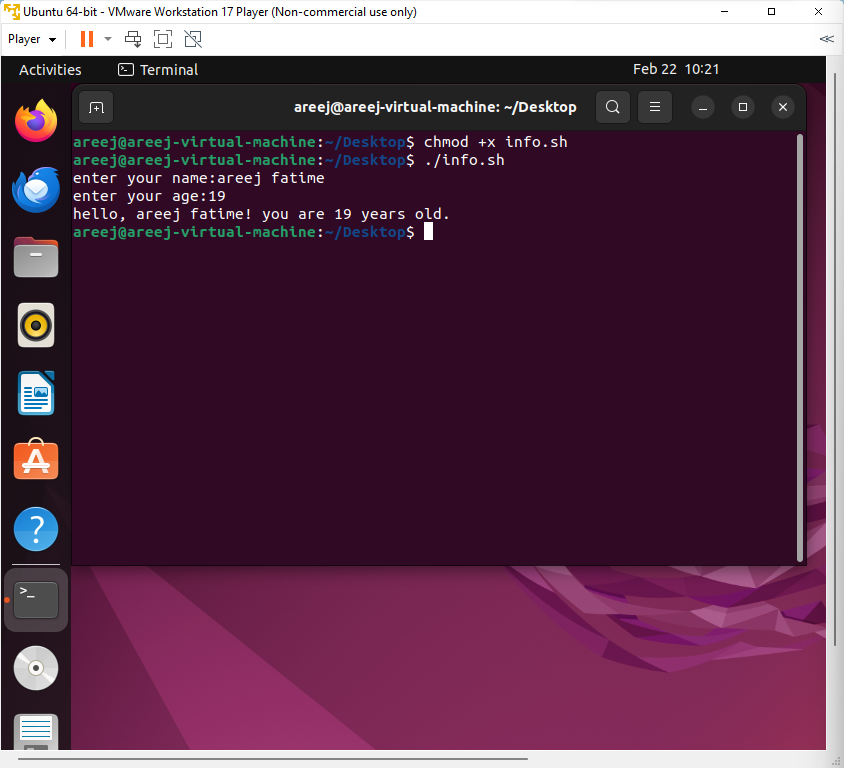

**3.Help Mr. Tom find his location:** Created a script, named `current_location.sh`, using `pwd` to display Mr. Tom's current location.

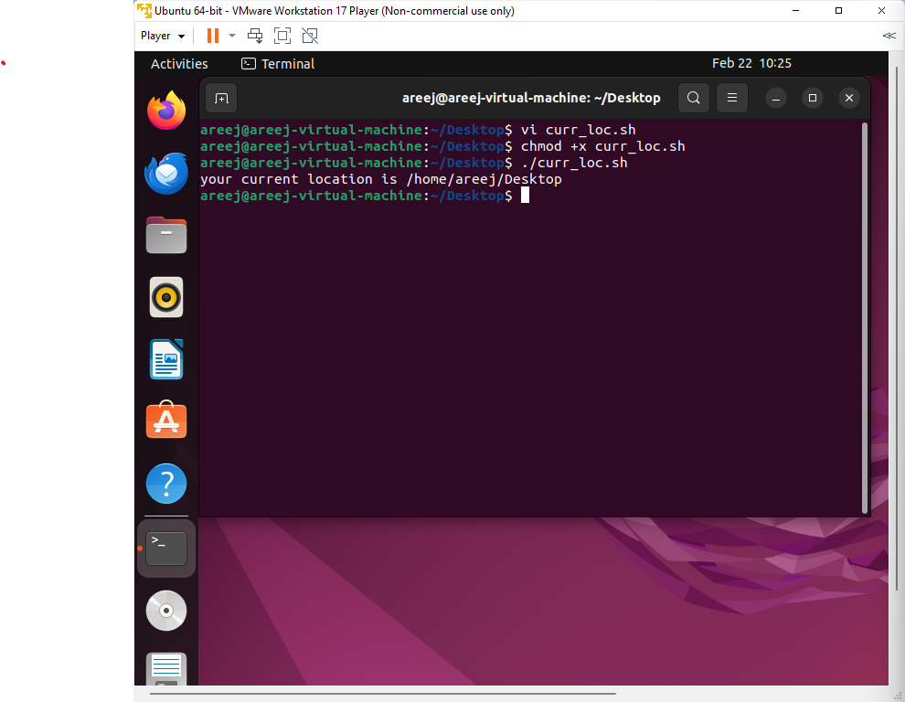

**4.List files in the home directory:** Created a script, named `list_files.sh`, using `ls -al ~` to list all files in Mr. Tom's home directory.

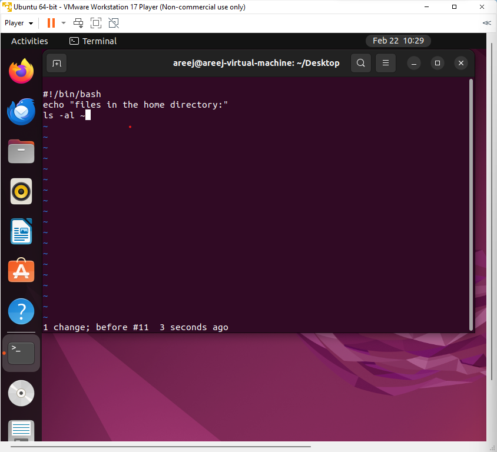

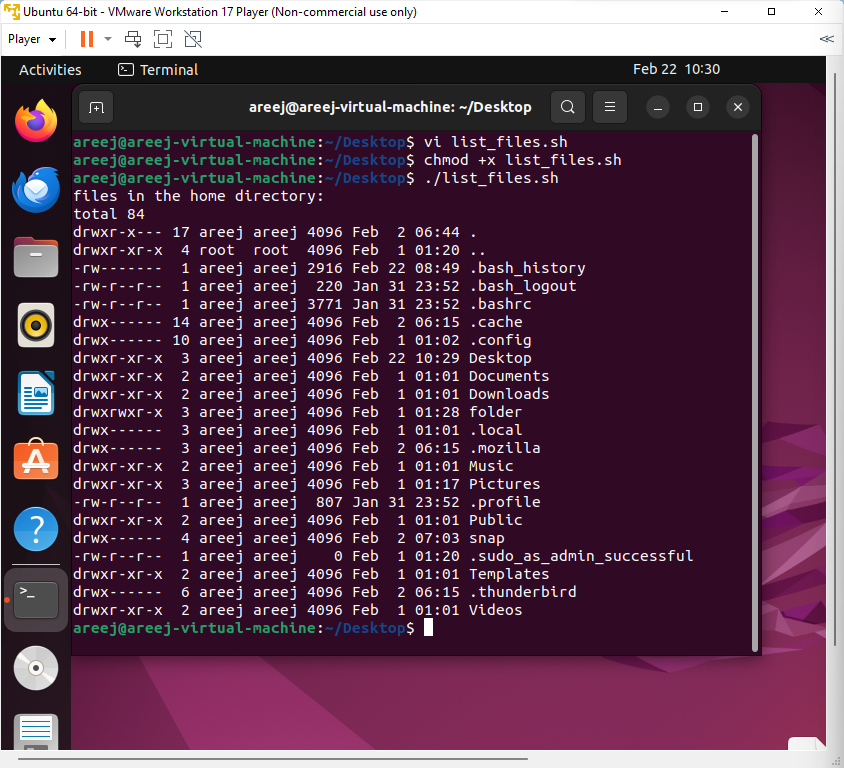

**5.Display the current time:** Created a script, named `current_time.sh`, using `date` to display the current system time.

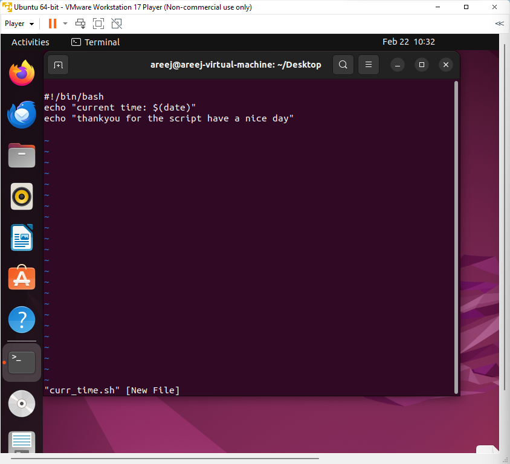

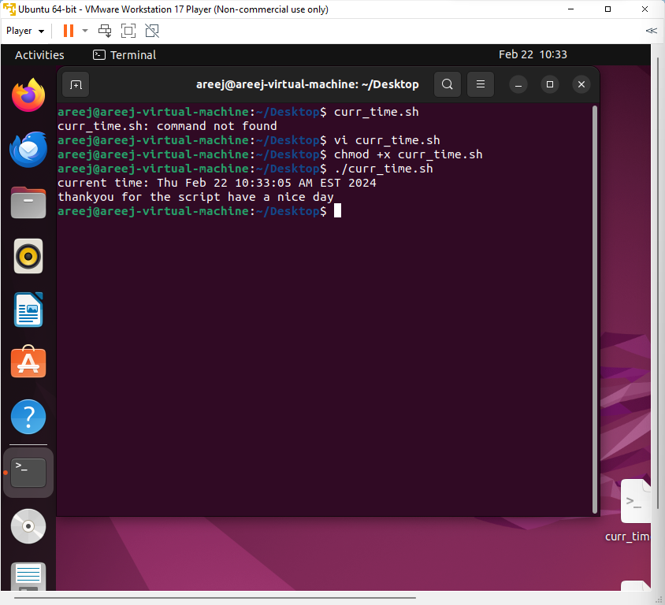

### Task 2: Shell Script Mastery

1. **Script with arithmetic operators:** Created a script, named `arithmetic_operations.sh`, using double parentheses `(( ))` to perform arithmetic operations and displayed results with a roll number.

   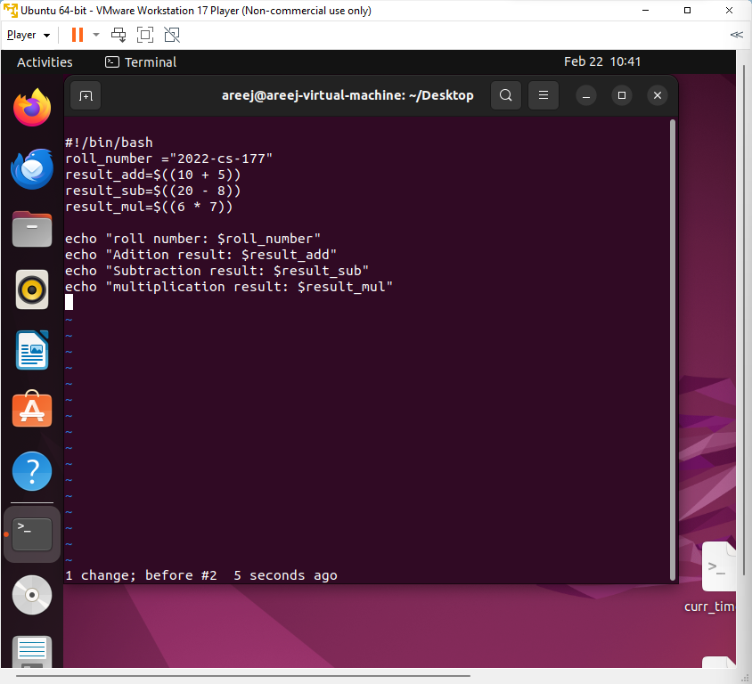

​       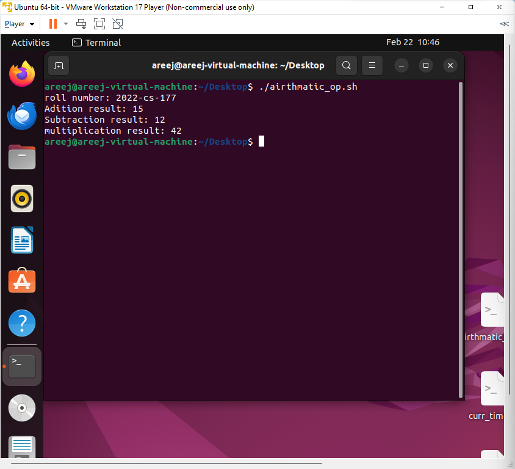

**2.**Script with relational operators: Created a script, named `relational_operations.sh`, using double parentheses `(( ))` to perform relational operations and displayed results with a roll number.

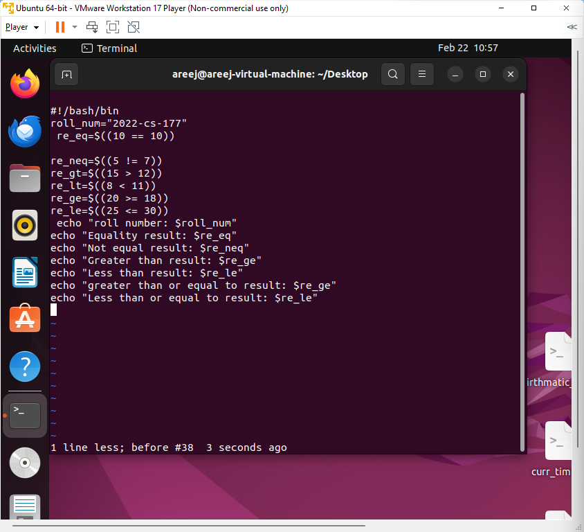

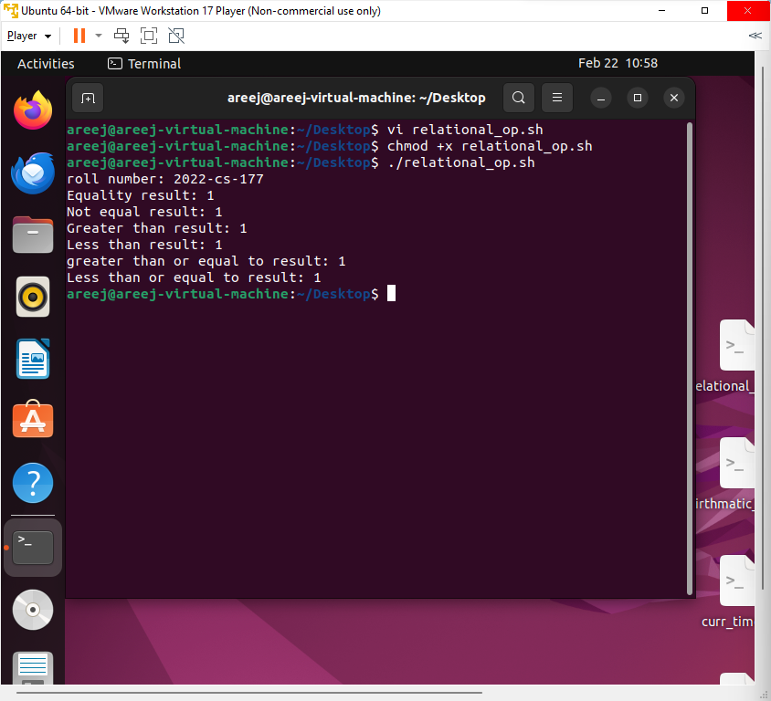

