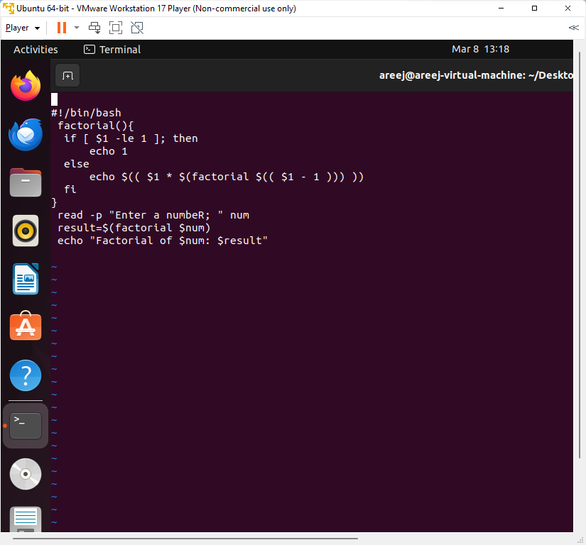

# **Lab3**

### Task 1: Decisions

1. **Larger Number Script (`larger_number.sh`):**
   - This script compares three command line arguments and finds the larger one using conditional statements.

**2.**Day Message Script (`day_message.sh`):**

- This script prints a message based on the current day of the week using a `case` statement.

## **Task 2: Loops**

**1.*Even/Odd Numbers Script (`even_odd_numbers.sh`):**

- This script uses a `for` loop to print numbers 1 to 10, determining if each is even or odd.

**2.Sum of Digits Script (`sum_of_digits.sh`):****

- This script reads a number, calculates the sum of its digits using recursion, and displays the result.

## **Task 2: Functions**

***1.Palindrome Check Script (`palindrome_check.sh`):****

- This script defines two functions (`reverse` and `palindromeCheck`) to check if a given number is a palindrome or not.

**2..Factorial Script (`factorial.sh`):****

- This script reads a number, passes it to a recursive function (`factorial`), and prints the factorial of the number.

**Github Link:**

